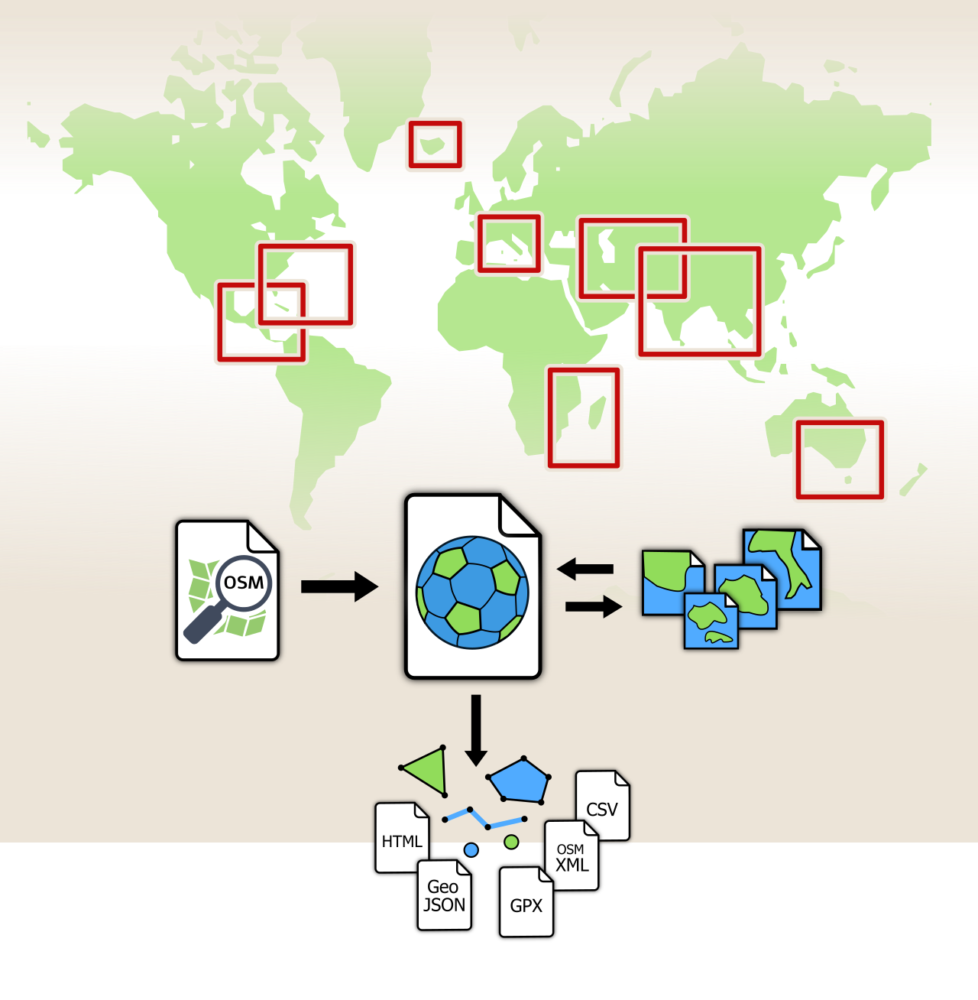

**GeoDesk** is a database engine 
for fast and easy geospatial analysis 
of **OpenStreetMap** data.

- *One-tenth* of the storage footprint of a traditional database   
 
- Typical queries run *50 times faster* than SQL

- Import OSM data in minutes instead of hours &mdash; or download
  ready-made tiles for just the regions you need.

- Seamless integration with **JTS** for *advanced geometry operations*

- 100% free & *open source*

We are avid supporters of OpenStreetMap ("OSM") &mdash; however, we are not affiliated with, or endorsed or sponsored by OSM. OpenStreetMap, OSM and the OSM logo are trademarks
of the OpenStreetMap Foundation. Learn more at the [official OSM website](http://wiki.openstreetmap.org).

